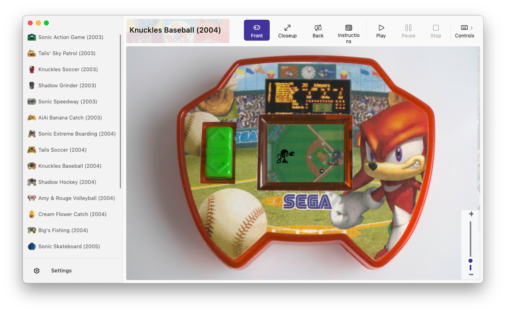

LCDonald
===========

Simulator engine for reproducing LCD games made by McDonald's in the 2000's.  
Mostly focused on simulating the [McDonald's Sonic LCD games](http://info.sonicretro.org/McDonald%27s_Sonic_LCD_games).  



You can read more details about the technical stack [here](https://tvc-16.science/lcdonald.html).  

Feel free to look at the [issues](https://github.com/Difegue/LCDonald/issues) if you want to help on a game!  

## Features

* SVG-based rendering for LCD elements
* Uses the well-known [MAMELayout](https://docs.mamedev.org/techspecs/layout_files.html) format for screen positioning
* [AvaloniaUI](http://avaloniaui.net/)-based frontend, runs on Windows/Mac/Linux -- Backend is pure .NET and can run on (mostly)anything!

All scanned/photographied materials in this repository are ©️SEGA, 2004/2005/2006.  

## Build instructions 


```
# Windows
cd LCDonald.Desktop && dotnet restore && dotnet publish .\LCDonald.Desktop.csproj -c release -r win-x64

# Linux
cd LCDonald.Desktop && dotnet restore && dotnet publish .\LCDonald.Desktop.csproj -c release -r linux-x64

# macOS
cd LCDonald.Desktop && dotnet restore && dotnet msbuild -t:BundleApp -p:RuntimeIdentifier=osx-x64 -property:Configuration=Release

# Android 
cd LCDonald.Android && dotnet build .\LCDonald.Android.csproj -c release 

```
